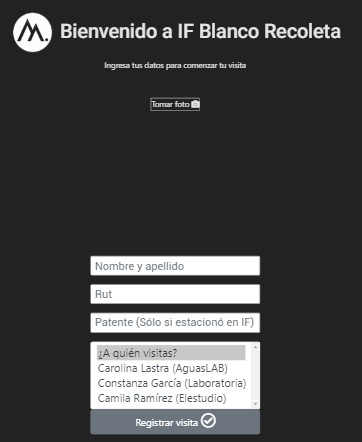

# Proyecto Final Common Core

Este es un proyecto para <b>Laboratoria Chile </b> e <b>IF Blanco Recoleta </b> :

## Plataforma para el registro del ingreso de personas a IF Blanco Recoleta.

### 1) Problema

Registrar el ingresos de personas a un recinto cada día puede ser un proceso muy tedioso, lento y manual. Completar una cantidad de hojas con un recuadro de datos que al final, terminan apiladas, llenas de polvo, sin sentido alguno y sin otro uso.

Es así como Laboratoria nos contactó para mejorar el sistema de ingresos de [IF Blanco Recoleta](http://www.ifblanco.cl/), un espacio colaborativo donde interactúan personas de distintas disciplinas, en un contexto de ayuda recíproca.

Al recinto a diario ingresan cientos de personas, desde trabajadores del lugar, proveedores y visistantes, hasta personas que asisten a reuniones o visitan IF Blanco para realizar alguna actividad. 
 
El ingreso se registra de forma manual por la recepcionista del recinto que trabaja de 8 a 18 hrs y posterior a ello por el portero que se retira a las 21 hrs. 

El sistema de ingreso consiste en una hoja con una tabla, en la que a la persona se le solicita Nombre, rut, patente (en caso que haya estacionado en IF), hora de ingreso y a quien visita. Posterior a ello, se le entrega una credencial que es distintitva según el lugar al que viene.

Para notificar el ingreso de una visita, existe un grupo de whatsapp donde se encuentra una persona de cada espacio, a la que se le notifica que en porteria hay un visitante al que deben ir a buscar en la recepción, de no pasar esto y que nadie asista a buscarlo, es el mismo recepcionista o alguien de IF quien va a dejarlo al lugar que viene.

La salida del recinto se notifica cuando la persona hace devolución de la credencial. 

### 2) Principales usuarios

Para identidicar a los usuarios del producto, considerando los requerimientos de Laboratoria y las jornadas de observación que realizamos en porteria, nos dimos cuenta que el principal usuario es la recepcionista y el portero.

Ambos, son lo que en la actualidad ingresan los datos de las personas en forma manual a la plantilla y que reconocen que las personas son "bastante cómodas" para auto-registrarse en la entrada del recinto, ádemas que uno de sus principales problemas es que las personas al venir rápido alguna reunión, a veces omiten alguno de los datos que se solicitan o que no se saben su patente y se molestan en que se las pidan dos veces. Debido a que frente al recinto, se encuentra el estacionamiento.

   * 2.1 Usuario I: Claudia, 38 años, casada con hijos, usuaria de smartphone, dominio computacional básico. Dominaba el pc que existía en recepción para el ingreso de visitantes antes de su extravió. Utiliza su número personal para notificar el ingreso de visitas al recinto, cumple un horario de 8 am a 18 horas. Lleva menos de un año trabajando en IF. 

   * 2.2 Usuario II: Rudy, 67 años, no es usuario de Smartphone y reconoce que no se maneja con la tecnología. Esta dispuesto aprender si el trabajo se lo requiere. Reemplaza a Claudia cuando ella va almorzar o al baño. Lleva más de un año en IF.

   * 2.3 Usuario III: Visitante, mayoritariamente con dominio de la tecnología. En ocasiones viene apurado o no sabe a donde va. 

   * 2.4 Usuario IV: Administradora, domina la tecnología, busca darle una utilidad a los registros que se generan a diario en el IF.

### 3) El producto 

Esta es una interfaz mobile first para registrar el ingreso de personas al espacio IF blanco Recoleta. Esta permite a la recepcionista del recinto ingresar en menor tiempo los datos de los visitantes y que estos a su vez, queden guardados en una tabla, la que le permitirá a la administradora, administrar los datos más simple y segura.

 

Primero, toma una fotografía del visitante, luego sus datos como nombre, rut (paso que se puede omitir),patente del vehículo si es que esta estacionado en IF. Luego, debe seleccionar a quien visita. Una vez guardado los datos, se le notifica a la persona que su visita llego por medio de un correo electrónico. 

Todos los datos ingresados se podran visualizar a través de una tabla, la que automáticamente genera el horario de ingreso y permitira filtrar por cualquiera de los datos ingresados su contenido. Permitiendo, reconocer cuantas veces una persona ha hecho ingreso al IF durante cierto periodo de tiempo.  
 

## 4) La solución
Este nuevo sistema permite de forma rápida y fácil que él o la recepcionista se registre al momento de ingresar en IF Blanco Recoleta. Si lo desean, también podría hacerlo el mismo usuario.

Su ventaja es el tiempo que disminuye el proceso de registro, porque podría demorarse solo un minuto de acuerdo al manejo del dispotivo tenga el usuario.

Además, es ecológico porque ya no van a tener que imprimir más hojas de papel con tablas que se van acumular sin revisión alguna desde la administración u otra persona. 

Su fácil administración permite una vista rápida e inmediata de los datos, que le permitiran tomar decisiones inmediata o más rápido. Por ejemplo, los días viernes ingresan más personas a las 9 am dentro de un mes, es por eso que se toma la decisión que a esa hora se pondrá un guardia de punto fijo en la puerta. 

## 5) Diseño de Interfaz de usuario

Para crear la interfaz se utilizaron los colores propios de IF Blanco. Blanco y negro, porque de esta forma la bienvenida al recinto es el sistema de registro de usuarios, que muestra una imagen cercana de un lugar. 

 

### Visualización del prototipo
Para ver el prototipo versión <b>Mobile</b> realizado en Figma, haz [click aquí.]
(https://www.figma.com/proto/Ne4eY479vjm6mAxndG9R9J0Q/Registro-IF?node-id=1%3A2&scaling=scale-down)